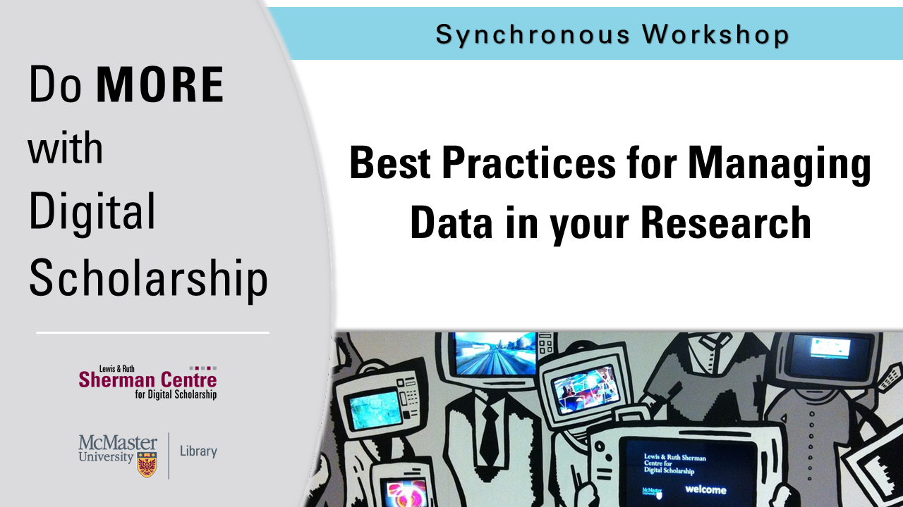

Welcome to the home of the McMaster Research Data Management Seminar Series.

On this page you will find links to webinars we have given on a variety of RDM topics. Follow the links below to access the slides and recordings as they become available after the synchronous presentations.

If you want to read more about RDM or access resources, check out the [Learn More](learn-more) page.

[Best Practices for Managing Data in your Research.](intro)

In this introductory workshop, learn about research data management best practices and how investing a small amount of time in organizing your data now can save you a lot of time and prevent future headaches. We will go over  best practices for data planning, storage, organization, preservation, and sharing.

[Building a Data Management Plan for your research project.](dmp)

Confucius said “One who does not plan long ahead will find trouble at his door”. In research, planning for data management helps you prepare for data questions and problems before they happen. In this session, we will go over principles of data management planning and go through a demo of the Portage DMP Assistant, a web-based tool for developing and collaborating on Data Management Plans in the Canadian research context.

[Strategies for research data storage and backup.](storage)

Looking for a better way to store your data? Not sure what the difference is between Dropbox or OneDrive? Join us for a session on research data storage and backup. In this workshop, we will go over the different storage platforms available to you as a researcher, their features and drawbacks, and when to choose a particular platform. We will also consider some data backup and security principles and touch on the basics of storing and encrypting sensitive research data.

[Essentials of open data sharing.](sharing)

Join the open data movement! Are you thinking about sharing your data? Have you been told by a journal or funder that you need to publish your data online? In this session, we will go over the benefits (and potential risks) of data sharing, and highlight some of the different data repository options available to you as a researcher.
