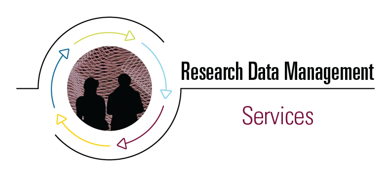

# Welcome to the home of the McMaster Research Data Management Seminar Series.

On this page you will find links to webinars we have given on a variety of RDM topics. Follow the links below to access the slides and recordings as they become available after the synchronous presentations.

If you want to read more about RDM or access resources, check out the [Learn More](learn-more) page.

If you're looking for upcoming live webinars and workshops, check out the listings on the [Sherman Centre website](https://scds.ca/events/dmds/2021-2022-2/).

If you are developing training on Research Data Management and would like to use our slides as a starting point, we would love to exchange PowerPoint files with you--please email [rdm@mcmaster.ca](mailto:rdm@mcmaster.ca).

[RDM Services](https://rdm.mcmaster.ca) at McMaster are provided by the [Sherman Centre for Digital Scholarship](https://scds.ca/) as part of the [Digital Research Commons Pilot](http://askresearch.mcmaster.ca) and sponsored by the [University Library](https://library.mcmaster.ca/)
